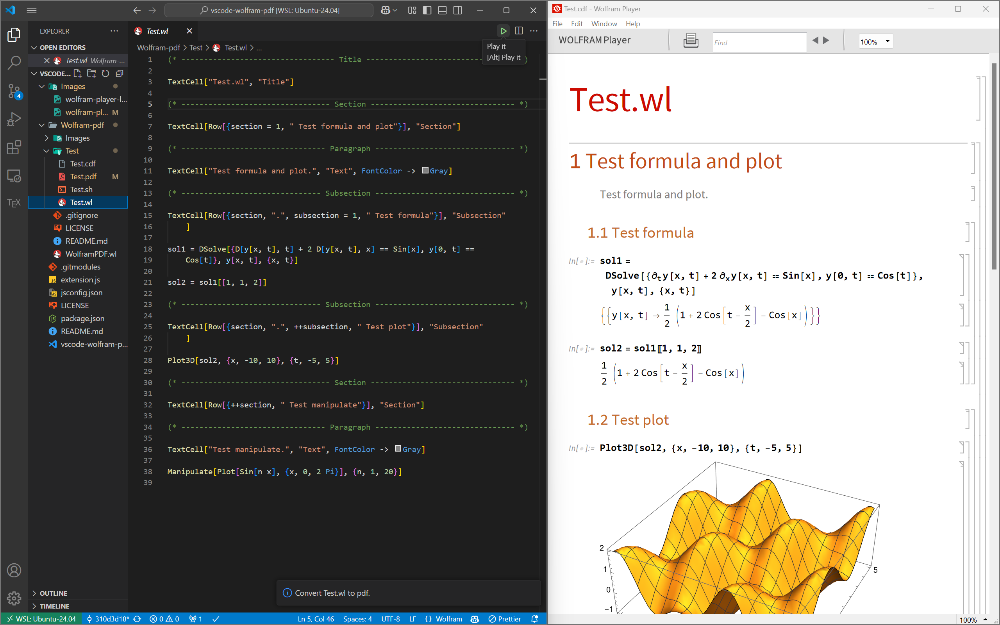

# vscode-wolfram-pdf
## Introduction
Convert wolfram script to pdf and cdf file, then show interactive result in wolfram player.



## Install and configuration

1. Install from the vsix file.
   ```bash
   git clone https://github.com/TurbulenceChaos/vscode-wolfram-pdf.git
   
   cd vscode-wolfram-pdf
   
   git submodule update --init --recursive
   ```
3. Make sure you have `wolframscript` and `wolframplayer` in your `PATH`.

4. Configure wolfram player path in your Settings.json.
   
    ```json
    {
        "wolfram.player.path": "/usr/local/Wolfram/WolframEngine/14.1/Executables/wolframplayer"
    }
    ```

## Usage

Open your wolfram script file and click the <kbd>Play it</kbd> button. 

## Development and build
1. Debug with vscode extension development (<kbd>F5</kbd>).

2. Use `vsce` to build the package.

    ```shell
    vsce package
    ```

3. No `node_modules`

## Reference

<https://github.com/asukaminato0721/mmaplayer>
